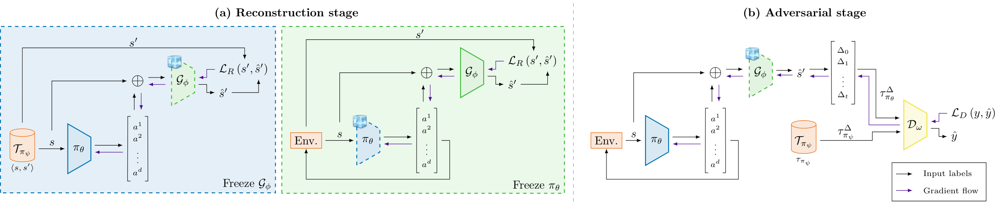

# Towards Generalisable Imitation Learning Through Conditioned Transition Estimation and Online Behaviour Alignment




Pytorch official implementation for Unsupervised Imitation Learning from Observation (UfO 🛸) from [Towards Generalisable Imitation Learning Through Conditioned Transition Estimation and Online Behaviour Alignment](https://openreview.net/forum?id=qZIsZfYzIS) (AAMAS 2026).

## Requirements
We use [UV](https://github.com/astral-sh/uv) in this project, but we have to install IL-Datasets from source locally to use the benchmark package.

```
Python == 3.10.12
UV >= 0.9.22
```

### Local dependencies

```bash
git clone https://github.com/NathanGavenski/IL-Datasets ../IL-Datasets
uv sync
```

### Docker

```bash
docker build -t ufo:latest .
docker run -it ufo:latest
```

## Running

UfO is divided into two stages: (i) [Reconstruction stage](train_reconstruction.py), and (ii) [Adversarial stage](train_adversarial.py).

### Reconstruction Stage
To train the first stage you simply need to:
```bash
python train_reconstruction.py --game <ENVIRONMENT> --epochs 1000
```
The code will load the hyperparameters from the configuration file at [config/unsupervised.yaml](config/unsupervised.yaml).
If the environment is not there, it will load the default values.

---

To use [Optuna](https://github.com/optuna/optuna) to find the best hyperparameters simply:
```bash
python train_reconstruction.py --game <ENVIRONMENT> --optuna
```
For the reconstruction stage, it will try to find the best learning rate for both the policy and the generative model.

---

To finetune use the `--weights` flag, passing the path to the folder with the weights.
```bash
python train_reconstruction.py --game <ENVIRONMENT> --epochs 1000 --weights <path_to_folder>
```

---

Additionaly, the script allows for other flags:
```
--size: the size of the teacher dataset (1,000 is the max)
--att: whether to use a policy with self-attention or not
--debug: creates a tensorboard with test in its name and deletes if you run it again
```

### Adversarial Stage

To train the second stage you simply need to:
```bash
python train_adversarial.py --game <ENVIRONMENT> --weights <path_to_folder>
```
Same as the first stage, the code will load the hyperparameters from the configuration file at [config/unsupervised.yaml](config/unsupervised.yaml).
If the environment is not there, it will load the default values.
The adversarial stage always saves the top 5 models, if you would like to save all, you will have to change the `ModelSaver` class.

---

To use [Optuna](https://github.com/optuna/optuna) to find the best hyperparameters simply:
```bash
python train_adversarial.py --game <ENVIRONMENT> --weights <path_to_folder> --optuna
```
For the adversarial stage, it will try to find the best learning rate for the discriminator model.

---

Additionaly, the script allows for other flags:
```
--att: whether to use a policy with self-attention or not
--debug: creates a tensorboard with test in its name and deletes if you run it again
```

## Citation

```latex
@inproceedings{gavenski2025towards,
  title={Towards Generalisable Imitation Learning Through Conditioned Transition Estimation and Online Behaviour Alignment},
  author={Nathan Gavenski and Matteo Leonetti and Odinaldo Rodrigues},
  booktitle={The 25th International Conference on Autonomous Agents and Multi-Agent Systems},
  year={2026},
  url={https://openreview.net/forum?id=qZIsZfYzIS}
}
```